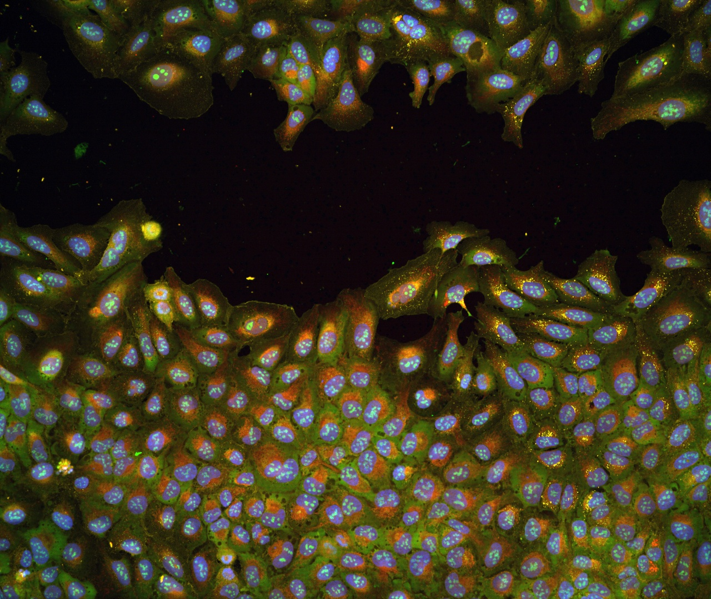
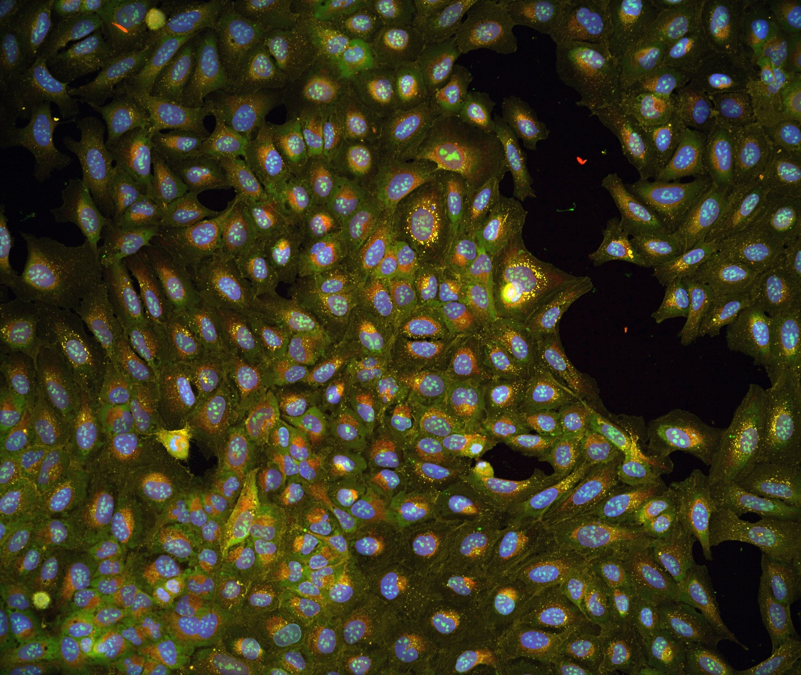
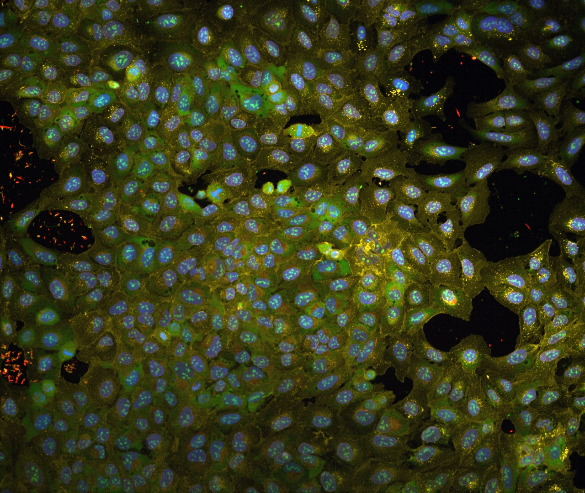

# How-To: JUMP MCP Server

The JUMP MCP server lets you query the JUMP Cell Painting dataset in plain language, directly from inside Claude (or any [Model Context Protocol](https://modelcontextprotocol.io) client). JUMP profiles how human cells respond — as high-dimensional morphological "fingerprints" — to hundreds of thousands of chemical and genetic perturbations. Answering even a basic question about that data normally means downloading multi-gigabyte profile tables and writing pandas/SQL. The JUMP MCP server removes that barrier: it exposes ~40 read-only query tools — gene/compound resolution, morphological nearest-neighbors, phenotypic activity and significance, interpretable CellProfiler features, gallery images, annotations, and provenance — so you can ask *"Was my gene tested? What does its knockout look like? What's morphologically similar to it?"* and get grounded, data-backed answers, complete with the original microscopy images, without writing code or moving data.

It is useful for **both audiences**: bench biologists can use the natural-language path with no programming, while computational users get the same tools plus direct setup and authentication.

> **Source code (separate repository):** <https://github.com/yashaektefaie/JumpAgent>
> — a FastAPI application deployed at [jump-agent.net](https://jump-agent.net) and exposed over MCP.

## Getting started

The server is **hosted** at `https://jump-agent.net` and speaks MCP natively — there is nothing to install or run locally and no data to download. You only need an MCP client and an API key.

### 1. Get an API key

Access to the data tools requires an API key, sent on every request as the `X-API-Key` header. There is no public self-serve signup yet — request a key from the JUMP Agent maintainer. In the configuration below, replace `<your-api-key>` with the key you receive.

### 2. Register the server

For **Claude Code**, add the hosted endpoint and restart:

```bash
claude mcp add --transport http jump https://jump-agent.net/mcp \
  --header "X-API-Key: <your-api-key>"
# then restart Claude Code
```

The same endpoint works with any MCP-compatible client that supports streamable-HTTP servers (e.g. Claude Desktop, Cursor): point the client at `https://jump-agent.net/mcp` and supply the `X-API-Key` header. Once connected, the `jump` tools appear automatically and Claude will call them when you ask JUMP-related questions.

### 3. Ask a question

That's it — ask in natural language. The worked examples below show the kinds of questions the server answers and the tool calls each one triggers.

## Case studies

The following five case studies all use one gene, **SLC2A2** (the glucose transporter *GLUT2*), and mirror the questions a biologist would ask when first looking up a gene — the same questions covered by the [JUMP_rr interactive tutorial](./interactive/1_jumprr_steps.md), but answered conversationally through the MCP server instead of the web tables.

### 1. Was my gene tested in JUMP?

**Question** — "Was SLC2A2 tested in the JUMP collection of perturbations?"

**Tool call** — `resolve`

**Result** — Yes, in both genetic modalities: a CRISPR knockout (`JCP2022_806487`) and an ORF overexpression reagent (`JCP2022_910380`). SLC2A2 is also a target of a JUMP compound — 2-deoxyglucose (`JCP2022_069590`), a glycolysis inhibitor annotated against `SLC2A1|SLC2A2|SLC2A3|SLC2A4`.

### 2. What do the perturbed cells look like, and the controls?

**Question** — "How do cells with SLC2A2 knocked out look, and how do their negative controls look?"

**Tool calls** — `gallery_images` (knockout) → `metadata_summary` (to find the matching negative control, the non-targeting guide `JCP2022_800002`) → `gallery_images` (control)

**Result** — The CRISPR knockout wells (e.g. well B14, plate CP-CC9-R1-02) show cells growing in islands with large open gaps; cells are larger and more spread, with pronounced orange-red perinuclear staining. The non-targeting control is a dense, uniform, confluent monolayer of smaller, tightly packed cells.

<div style="display: flex; flex-wrap: wrap; gap: 1rem; justify-content: center; margin: 1rem 0;">
  <figure style="flex: 1 1 280px; max-width: 380px; margin: 0;">
    
    <figcaption style="font-size: 0.85em; text-align: center; margin-top: 0.3rem;"><em>SLC2A2 CRISPR knockout — well B14, plate CP-CC9-R1-02</em></figcaption>
  </figure>
  <figure style="flex: 1 1 280px; max-width: 380px; margin: 0;">
    
    <figcaption style="font-size: 0.85em; text-align: center; margin-top: 0.3rem;"><em>SLC2A2 CRISPR knockout — second field of view</em></figcaption>
  </figure>
  <figure style="flex: 1 1 280px; max-width: 380px; margin: 0;">
    
    <figcaption style="font-size: 0.85em; text-align: center; margin-top: 0.3rem;"><em>Non-targeting control (JCP2022_800002)</em></figcaption>
  </figure>
</div>

The sparse, enlarged, orange knockout fields versus the dense, uniform control directly mirror the quantitative feature signature in case study 4.

### 3. Does my gene produce a phenotype when knocked down or overexpressed?

**Question** — "Does SLC2A2 produce a morphological phenotype when overexpressed (ORF) or knocked down (CRISPR)?"

**Tool calls** — `gallery_images` (crispr and orf) — the JUMP_rr gallery records carry the per-perturbation `Corrected p-value` and `Phenotypic activity` columns alongside the images.

**Result** — The two modalities disagree, which is itself informative:

| Modality | Corrected p-value | Phenotypic activity | Phenotype? |
| ----- | ----- | ----- | ----- |
| CRISPR knockout | 0.00018 | 0.919 | **Yes** — distinct from controls |
| ORF overexpression | 0.095 | 0.747 | No (above the 0.05 threshold) |

Knocking *out* SLC2A2 changes cell morphology significantly; overexpressing it does not produce a detectable change.

### 4. Which specific morphological features change?

**Question** — "What are the specific morphological changes for the SLC2A2 knockout?"

**Tool call** — `interpretable_features` (crispr)

**Result** — Ranked by effect size (Cohen's *d*), the top features are:

| Feature | Compartment / Channel | Cohen's *d* | Direction |
| ----- | ----- | ----- | ----- |
| Granularity_10 | Nuclei / DNA | +5.13 | ↑ coarser chromatin |
| Granularity_9 | Nuclei / DNA | +4.29 | ↑ coarser chromatin |
| Cell count | Cells | −3.89 | ↓ fewer cells |
| Granularity_10 | Cells / DNA | +3.73 | ↑ |
| Minor axis length | Nuclei | +3.23 | ↑ enlarged nuclei |
| Integrated intensity | Cytoplasm / RNA | +3.21 | ↑ more RNA signal |
| Intensity (edge) | Nuclei / Mito | +3.17 | ↑ more mitochondrial signal |
| Area | Nuclei | +3.16 | ↑ enlarged nuclei |

Together: fewer cells, enlarged nuclei with coarser chromatin, and elevated mitochondrial and RNA signal — a metabolic-stress / growth-arrest pattern consistent with the images above.

> **Known quirk** — the `Feature significance` column comes back as `0` for every feature (values are rounded below five decimal places). Rank features by **Cohen's *d*** or **Feature Rank** instead of feature significance.

### 5. What other genes look similar (or anti-similar)?

**Question** — "What other perturbations are morphologically similar to the SLC2A2 knockout?"

**Tool call** — `nearest_neighbors` (crispr)

**Result** — The nearest morphological neighbors are dominated by DNA-replication / repair and cell-cycle genes:

| Rank | Match | Cosine similarity |
| ----- | ----- | ----- |
| 1 | RAD51 | 0.62 |
| 2 | BACE1 | 0.61 |
| 3 | FANCM | 0.61 |
| 4 | TONSL | 0.61 |
| 5 | POLE | 0.61 |
| 6 | POLA1 | 0.60 |
| 7 | POLA2 | 0.59 |
| 8 | RPA1 | 0.59 |

This DNA-replication / cell-cycle signature is a strong starting point for hypothesis generation about SLC2A2's role.

> **Note** — `nearest_neighbors` returns the top *positive* matches. The full JUMP_rr cosine-similarity table additionally contains *anti-matches* (perturbations with the opposite phenotype) down to roughly −0.51 for this gene.

## What's inside (technical play-by-play)

### How a query flows, end to end

1. **You ask** a question in your MCP client.
2. **Claude selects a tool** and calls the hosted MCP server at `https://jump-agent.net/mcp` over streamable HTTP, authenticated with your `X-API-Key`.
3. **The server** (the FastAPI app at [github.com/yashaektefaie/JumpAgent](https://github.com/yashaektefaie/JumpAgent)) maps that tool to a **read-only** query over its data backends:
   - **DuckDB** over the JUMP production profile tables — e.g. `compound_no_source7`, the default Harmony-corrected compound profiles (source_7 excluded), plus the CRISPR, ORF, and compound modalities.
   - The **JUMP_rr Zenodo parquet tables** — per-modality `cosinesim`, `cohens_d`, `significance`, `gallery`, and `interpretable_features` — which power the similarity, feature, significance, and image lookups.
   - The **Cell Painting Gallery**, the source of the microscopy image URLs returned by the gallery tool.
4. **Results return as structured JSON**, which Claude turns into the answer. Claude can chain tools — for example `resolve` → `gallery_images` → `interpretable_features` — to answer a multi-part question, exactly as in the case studies above.

### Key tools

The server exposes ~40 tools; the ones used most often (and throughout the case studies above) are:

| Tool | What it does |
| ----- | ----- |
| `resolve` | Resolve a name, JCP ID, SMILES, gene, target, or MoA to canonical entities |
| `get_entity_summary` | Compound/gene metadata, with optional activity |
| `search_entities` | Filter compounds by metadata, properties, activity, and source |
| `nearest_neighbors` | Morphological nearest matches for a perturbation (JUMP_rr) |
| `pairwise_similarity` | Exact pairwise cosine similarity for a small set of IDs |
| `interpretable_features` | Top interpretable CellProfiler features for a perturbation |
| `gallery_images` | Microscopy image URLs (plus significance/activity columns) |
| `get_activity` / `get_activity_summary` | copairs phenotypic-activity scores and calls (compounds) |
| `get_consistency` | Target / MoA / annotation consistency scores |
| `chemical_properties` | RDKit physicochemical properties for a compound |
| `annotations` / `annotation_coverage` | Rows from curated annotation tables, and coverage summaries |
| `metadata_summary` | Bounded group-by summaries over metadata / copairs tables |
| `provenance` | Data paths, sizes, and service provenance |

The remaining tools cover dataset/schema discovery (`list_datasets`, `describe_schema`, `profile_features`, `profile_rows`), structure–activity analysis (`activity_cliffs`, `scaffold_series`, `dark_matter`), cross-config and cross-source comparisons (`compare_configs`, `activity_compare`, `consistency_compare`, `consistency_sweep`, `cross_source`), well-level QC (`well_cell_counts`), bundled neighborhood lookups (`workflow_neighborhood`, `workflow_compose`), and saved artifacts (`artifact_search`, `artifact_read`). Every tool is **read-only** — the server queries data, it never modifies it.

### Data it queries

- **`compound_no_source7`** — the default compound profile dataset (Harmony-corrected, source_7 excluded), alongside the CRISPR, ORF, and compound perturbation modalities.
- The **JUMP production datastore** and the **JUMP_rr Zenodo parquet tables** (per-modality `cosinesim`, `cohens_d`, `significance`, `gallery`, `interpretable_features`).
- The **Cell Painting Gallery**, the source of the microscopy images returned by the gallery tool.
